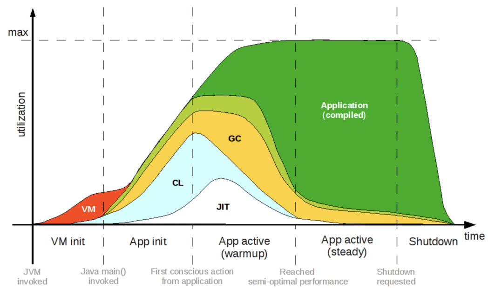

# 云原生时代的 Java

### Java 的危机

<u>Write once, run anywhere</u>

<u>Design for long-term running, large-scale hardware & softwore</u>

Managed vs Native

Java assumes application is:

* Consists of few macro-instances
* Design for continuous running

Focus on:

* Long-term performance
* Effective use large-scale hardware
* Develop large-scale software

Cloud-native assumes application is:

* Consists of mass micro-instances
* Design for failure & resilience

Focus on:

* Container friendliness (images size, resource consumption)
* Bootstrap / reboot effectiveness
* Organized around business capability

### Java 的变革

**Leyden**

<u>Allow the code that is not known about before a program starts</u>

Ahead-of-Time Compilation, AOT

Java 支持提前编译最大的困难在于它是一门动态链接语言，它假设程序的代码空间是开放的（Open World），允许程序在任何时候通过类加载器去加载新的类，作为程序的一部分运行。要进行提前编译，就必须放弃这部分动态性，假设程序的代码空间是封闭的（Closed World），所有要运行的代码都必须在编译期全部可知。

Not Supported:

* Dynamic Class Loading / Unloading

* Runtime Bytecode Generation

* InvokeDynamic

用户在编译期，以配置文件或者编译器参数的形式，明确告知编译器程序代码中有哪些方法是通过反射来访问的，编译器将方法添加到静态编译的范畴之中。同理，所有使用到动态代理的地方，也必须事先列明，在编译期就将动态代理的字节码全部生成出来。

Spring + GraalVM

让程序以经典方式运行（启动）一次，自动化地找出程序中的反射、动态代理的代码，代替用户向编译器提供绝大部分所需的信息，并将启动时初始化的 Bean 在编译期就完成初始化，直接绕过 Spring 启动最慢的阶段。

**Valhalla**

<u>Everything is an object</u>

**Loom**

<u>Unified Java Multithreading Model & Memory Model</u>

**Portola**

